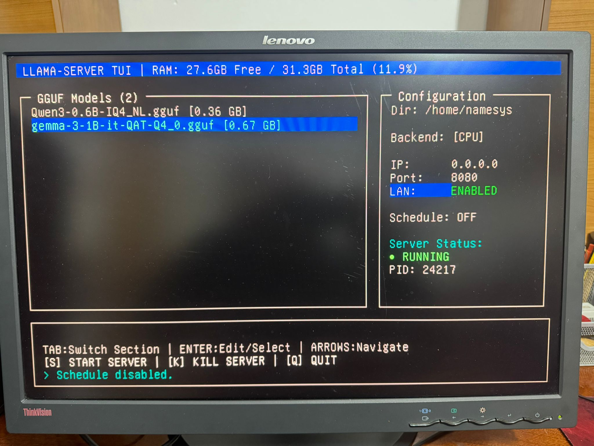

# LLAMA.CPP-SERVER-FRONTEND-FOR-CONSOLE
THIS IS A LLAMA.CPP SERVER FRONTEND TO SERVE IN LAN MULTIPLE GGUFS 

Here include binary executable for debian 12 AMD64 and Python file to compile.
See intructions on Readme.md
HOW TO RUN THE PROGRAM

first make a environment

python3 -m venv entorno

cpy files here

FIRST WITH PYTHON3 INSTALLED AND NO COMPILATION:

deinflating .zip

to /entorno
activate /entorno/bin/activate

firSt install this library: psutil

pip install putil 

and now you can run python3 serverllama.py

for run in all filesystem you must  export llama server to your system path for can run from every directory

for example:

export PATH="$PATH:/home/namesys/llama.cpp-master/build/bin"

**********HOW TO COMPILE THE BINARY

compile it if you want binary for your system

pip install pyinstaller

pyinstaller --onefile llamaserver.py

the file would be written do /dist 
assign execution permission
chmod +x llamaserver.py

you can rename for name do you want.

execute , and navigate with 

ALSO I INCLUDE IN THE DIRECTORY debian 12amd64 binary the program compiled yet 
for this architecture amd64 debian and ubuntu only need permision and run
